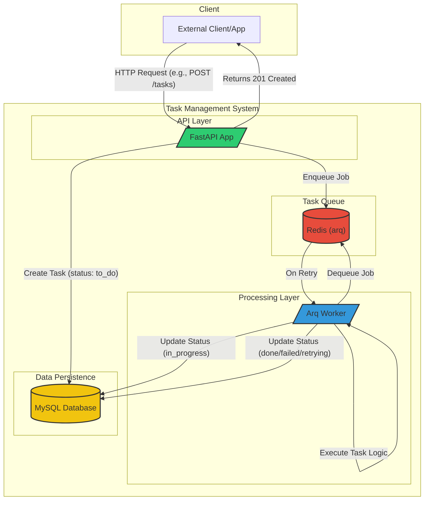
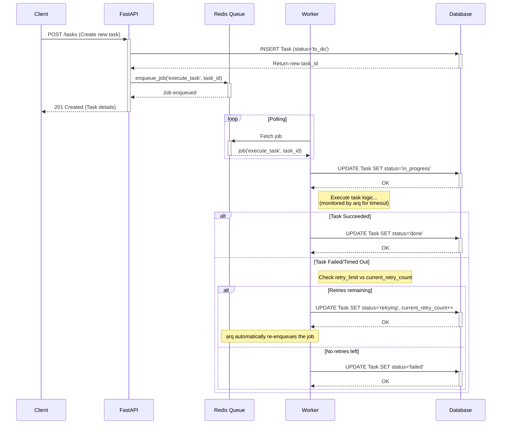
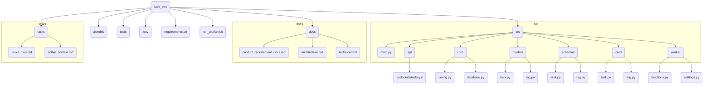

## Architecture Diagram (Conceptual)

```mermaid
graph TD
    subgraph "Client"
        User[External Client/App]
    end

    subgraph "Task Management System"
        subgraph "API Layer"
            API[/"FastAPI App"/]
        end

        subgraph "Task Queue"
            Queue[("Redis (arq)")]
        end

        subgraph "Processing Layer"
            Worker[/"Arq Worker"/]
        end

        subgraph "Data Persistence"
            DB[("MySQL Database")]
        end
    end

    User -- "HTTP Request (e.g., POST /tasks)" --> API
    API -- "Returns 201 Created" --> User
    API -- "Create Task (status: to_do)" --> DB
    API -- "Enqueue Job" --> Queue
    Worker -- "Dequeue Job" --> Queue
    Worker -- "Update Status (in_progress)" --> DB
    Worker -- "Execute Task Logic" --> Worker
    Worker -- "Update Status (done/failed/retrying)" --> DB
    Queue -- "On Retry" --> Worker

    style API fill:#2ecc71,stroke:#333,stroke-width:2px
    style Worker fill:#3498db,stroke:#333,stroke-width:2px
    style Queue fill:#e74c3c,stroke:#333,stroke-width:2px
    style DB fill:#f1c40f,stroke:#333,stroke-width:2px
```

## System Workflow (Solution Overview)

```mermaid
sequenceDiagram
    participant Client
    participant FastAPI
    participant ArqRedis as Redis Queue
    participant ArqWorker as Worker
    participant MySQL_DB as Database

    Client->>+FastAPI: POST /tasks (Create new task)
    FastAPI->>+MySQL_DB: INSERT Task (status='to_do')
    MySQL_DB-->>-FastAPI: Return new task_id
    FastAPI->>+ArqRedis: enqueue_job('execute_task', task_id)
    ArqRedis-->>-FastAPI: Job enqueued
    FastAPI-->>-Client: 201 Created (Task details)

    loop Polling
        ArqWorker->>+ArqRedis: Fetch job
        ArqRedis-->>-ArqWorker: job('execute_task', task_id)
    end

    ArqWorker->>+MySQL_DB: UPDATE Task SET status='in_progress'
    MySQL_DB-->>-ArqWorker: OK

    Note right of ArqWorker: Execute task logic...<br/>(monitored by arq for timeout)

    alt Task Succeeded
        ArqWorker->>+MySQL_DB: UPDATE Task SET status='done'
        MySQL_DB-->>-ArqWorker: OK
    else Task Failed/Timed Out
        Note right of ArqWorker: Check retry_limit vs current_retry_count
        alt Retries remaining
            ArqWorker->>+MySQL_DB: UPDATE Task SET status='retrying', current_retry_count++
            MySQL_DB-->>-ArqWorker: OK
            Note over ArqWorker, ArqRedis: arq automatically re-enqueues the job
        else No retries left
            ArqWorker->>+MySQL_DB: UPDATE Task SET status='failed'
            MySQL_DB-->>-ArqWorker: OK
        end
    end
```

## Directory Structure

```mermaid
graph TD
    A(task_zen) --> B(src)
    A --> C(alembic)
    A --> D(tests)
    A --> E(docs)
    A --> F(tasks)
    A --> G(.env)
    A --> H(requirements.txt)
    A --> I(run_worker.sh)

    subgraph src
        B --> B1(main.py)
        B --> B2(api)
        B --> B3(core)
        B --> B4(models)
        B --> B5(schemas)
        B --> B6(crud)
        B --> B7(worker)
    end
    
    B2 --> B2a(endpoints/tasks.py)
    B3 --> B3a(config.py)
    B3 --> B3b(database.py)
    B4 --> B4a(task.py)
    B4 --> B4b(tag.py)
    B5 --> B5a(task.py)
    B5 --> B5b(tag.py)
    B6 --> B6a(task.py)
    B6 --> B6b(tag.py)
    B7 --> B7a(functions.py)
    B7 --> B7b(settings.py)

    subgraph docs
        E --> Ea(product_requirement_docs.md)
        E --> Eb(architecture.md)
        E --> Ec(technical.md)
    end

    subgraph tasks
        F --> Fa(tasks_plan.md)
        F --> Fb(active_context.md)
    end
```